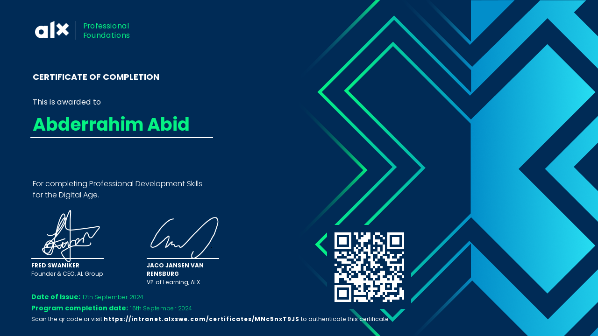

# ALX Professional Foundation Certificate

Hi there! 👋  
Welcome to the repository showcasing my **Professional Foundation Certificate** earned from the prestigious **ALX Program**.

## 🌟 About the Certificate  
The **ALX Professional Foundation Certificate** is a recognition of the skills and knowledge I acquired through the **ALX Program**, focusing on:  
- Professionalism in the workplace  
- Effective communication and collaboration  
- Problem-solving strategies  
- Critical thinking and adaptability  

This certification demonstrates my commitment to continuous learning, skill development, and excelling in any professional environment.

---

## 🏆 Certificate Preview  
Here’s a preview of the certificate:  

---

Thank you for visiting this repository!  